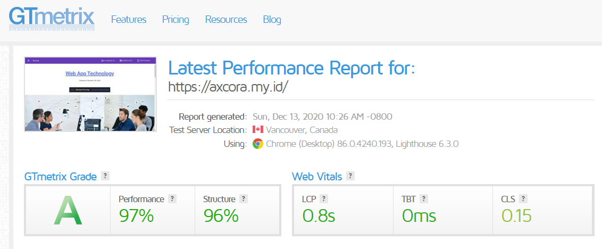

# New Modern CMS Build a website without database.

A new generation get simpe cms axcora tech for develope website project powerfull !!

No need a database for installation , make your website very fast and SEO friendly.

Fashion Template for get axcora cms.

+ Modern design with boostrap 5
+ New generation with get axcora cms modern web apps.
+ Responsif website and mobile first
+ With Home page menu, how to order menu , contact menu , and product pages menu.

--------------

Login Area for backend

Page and article post menu.

Create article post very simple and easy

File manager system

Back end setting

New Update POS apps plugin for modern website + POS application web app

 -----------------------------------------------------------------
### how to install

CLOUDS / SHARED HOSTING

Just download this file and upload on your shared or clouds host , upload on public_html fle if you using this cms for develope home page website, or you can upload it on sub directori .
After upload progress success. Your website is online now . for first need to configure site with accsess on backend - visit yourwebsite/admin - login with user : axcora / pass : axcoracms - then visit on setting change URL with yoursite, and save.

LOCALHOST

Need third party XAMPP WAMPP LAMPP server, download this project and upload on your xampp/htdocs folder,  for first need to configure site with accsess on backend - visit localhost/projectweb/admin - login with user : axcora / pass : axcoracms - then visit on setting change URL with yoursite example localhost/projectweb/admin, and save.

By default use username : axcora and password : axcoracms

Test Speed using [company profile themes](https://github.com/mesinkasir/companyprofilwebsite-getaxcoracms)

 -----------------------------------------------------------------
### how to install

CLOUDS / SHARED HOSTING

Just download this file and upload on your shared or clouds host , upload on public_html fle if you using this cms for develope home page website, or you can upload it on sub directori .
After upload progress success, now you need to configure website.xml file on \getaxcora\data\other\website.xml file. then change <SITEURL><![CDATA[http://localhost/getaxcoracms/]]></SITEURL> with your site URL.
Your website is online now . for accsess backend you need visit yourwebsite/admin

LOCALHOST

Need third party XAMPP WAMPP LAMPP server, download this project and upload on your xampp/htdocs folder, then visit localhost/your project. need to configure website.xml file on \getaxcora\data\other\website.xml file. then change <SITEURL><![CDATA[http://localhost/getaxcoracms/]]></SITEURL> with your site URL.
Your website is online now on localhost. for accsess backend menu you need visit localhost/yourproject/admin

By default use username : axcora and password : axcoracms

---------------------------------

Features :

Frontend
+ Home page design with landing page
+ Embed Youtube Video on home page
+ Product page with price info
+ How to order page 
+ Contact Page information

Backend
+ Page for create new post article content you can edit and delete too.
+ File menu for upload media manager
+ Setting for change password and others.
+ SEO : automaticly generate meta title , description , facebook, twitter.

No need a database installation make your website very fast, and of course with SEO friendly include, simple and easy to use.

Need demo ?? [Just Play Demo Video →](https://www.youtube.com/watch?v=X4fXZSY4NyA)

Live test speed and demo website using company profile themes
https://axcora.my.id

More themes :
https://axcora.com/getaxcoracms

present by https://axcora.com

Hapy codding !!
